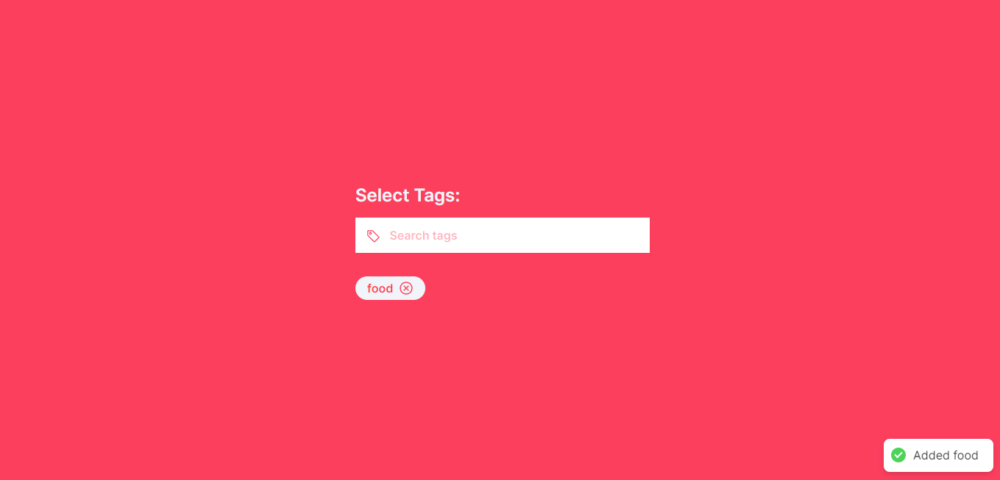
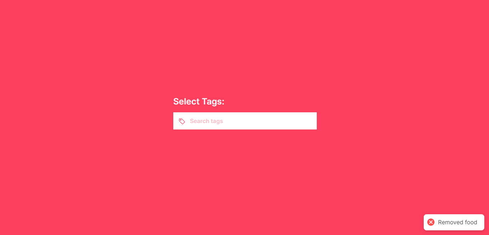

## Set up Locally

First, Install the dependencies and devDependencies

```bash
yarn
# or
npm i
# or
pnpm i
```

Second, run the development server:

```bash
npm run dev
# or
yarn dev
# or
pnpm dev
```

Open [http://localhost:3000](http://localhost:3000) with your browser to see the result.
